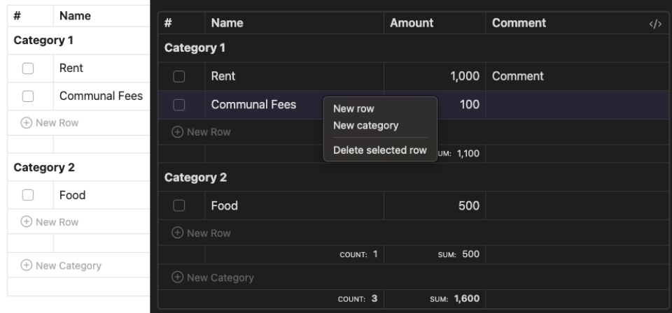

# Obsidian Budget Planner Plugin

[](https://github.com/kalinichenko88/obsidian-budget-planner-plugin/actions/workflows/quality.yml)
[](https://github.com/kalinichenko88/obsidian-budget-planner-plugin/actions/workflows/release.yml)

> A minimalist budget planning plugin for Obsidian that lets you manage finances directly in your notes using markdown code blocks.



## ✨ Features

- 📝 Native markdown code block syntax
- 📊 Category-based expense organization
- ✅ Interactive checkboxes for expense tracking
- 🔄 Auto-formatting and alignment
- 📈 Column sorting capabilities
- 💰 Automatic category and total summations
- 🔧 Seamless Obsidian integration

[Features docs](docs/features.md)

## 📖 Usage

### Quick Start

1. Open a note in Obsidian where you want to add a budget planner
2. Use the command palette (**Cmd+P** on macOS or **Ctrl+P** on Windows/Linux) and search for `Insert Budget Planner`
3. Start editing your budget!

### Examples

Create budgets using the `budget` code block:

```budget
Online Services:
    [x] Spotify    | $4.99
    [] Youtube     | $16.99
    [] 1Password   | $6.95
Entertainment:
    [] Netflix     | $12.99
```

## 🚀 Installation

1. Download latest release from [GitHub releases](https://github.com/kalinichenko88/obsidian-budget-planner-plugin/releases)
2. Extract to your vault's `.obsidian/plugins/` folder
3. Reload Obsidian
4. Enable plugin in Settings > Community Plugins

## 🤝 Contributing

1. Fork the repository
2. Create feature branch (`git checkout -b feature/amazing-feature`)
3. Commit changes (`git commit -m 'Add amazing feature'`)
4. Push to branch (`git push origin feature/amazing-feature`)
5. Open Pull Request

## 📄 License

MIT License - see [LICENSE](LICENSE) for details

## 💬 Support

- [Open an issue](https://github.com/kalinichenko88/obsidian-budget-planner-plugin/issues)

## 🔖 Docs

- [How to Release](docs/release-process.md)
