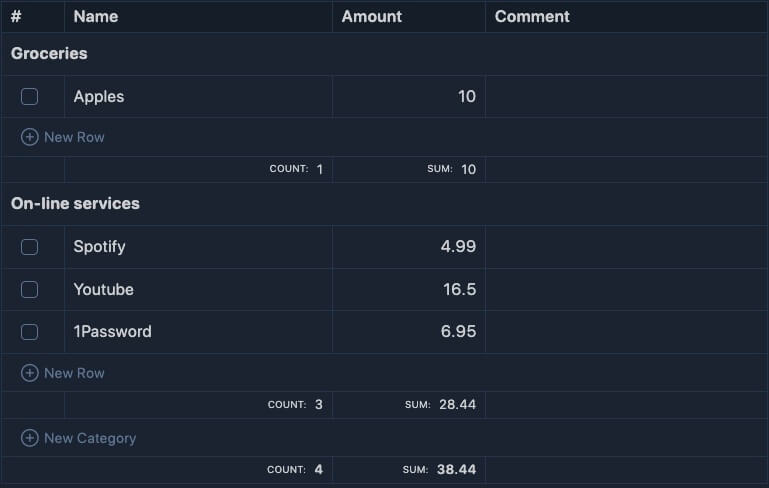

# Obsidian Budget Planner Plugin


A simple, powerful budget planning tool for Obsidian. This plugin allows you to create and manage budgets directly in your notes using markdown code blocks. Track expenses, organize by categories, and keep your financial planning within your knowledge base.



## Features

- Create and manage budgets directly in Obsidian using markdown code blocks.
- Organize expenses by categories.
- Automatically format and align budget entries for better readability.
- Track expenses with checkboxes to mark completed payments.
- Fully integrated with Obsidian's markdown editor.

## Examples:

### Without category

````
```budget
[x] Spotify    | $4.99
[] Youtube    | $16.99
[] 1Password  | 6.95
````

### With category

````
```budget
Online services:
	[] Spotify    | $4.99
	[] Youtube    | $16.99
	[] 1Password  | 6.95
Others:
	[] Netflix    | $12.99
````

## Installation

1. Download the plugin from the [GitHub releases page](https://github.com/kalinichenko88/obsidian-budget-planner-plugin/releases).
2. Place the plugin folder in your Obsidian vault's `.obsidian/plugins/` directory.
3. Enable the plugin in Obsidian by navigating to **Settings > Community Plugins** and toggling it on.

## Usage

1. Open a note in Obsidian where you want to add a budget planner.
2. Use the command palette (**Cmd+P** on macOS or **Ctrl+P** on Windows/Linux) and search for `Insert Budget Planner`.
3. Select the command, and a default `budget` code block will be inserted into your note:
   ````
   ```budget
   [] Example Item | $10.00
   ````
4. Save the note, and the plugin will render the budget table with interactive checkboxes and formatting.

## Contributing

Contributions are welcome! Please follow these steps:

1. Fork the repository.
2. Create a new branch for your feature or bugfix.
3. Submit a pull request with a clear description of your changes.

## License

This project is licensed under the MIT License. See the [LICENSE](LICENSE) file for details.

## Support

If you encounter any issues or have feature requests, please open an issue on the [GitHub repository](https://github.com/kalinichenko88/obsidian-budget-planner-plugin/issues).
