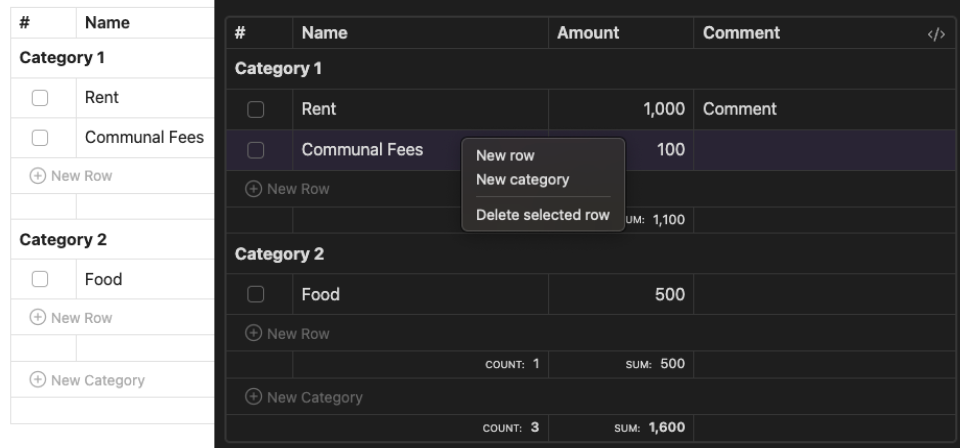

# Budget Planner

[](https://github.com/kalinichenko88/obsidian-budget-planner-plugin/actions/workflows/quality.yml)
[](https://github.com/kalinichenko88/obsidian-budget-planner-plugin/actions/workflows/release.yml)

> A minimalist budget planning plugin that lets you manage finances directly in your notes using markdown code blocks.



## ✨ Features

- 📝 Plain markdown storage — the table is just a `budget` code block, editable by hand
- 📊 Categories with per-category count and sum (shown when there is more than one category)
- ✅ Click a row's checkbox to mark it paid; totals also show unchecked count and sum
- ✏️ Inline editing of name, amount and comment (Enter saves, Escape cancels)
- 🔗 Comments render inline markdown (wikilinks, external links, bold, tags) in editing view
- 🔀 Drag rows between categories and reorder categories via the grip handle
- 📈 Right-click a column header (`#`, `Name`, `Amount`) to sort rows inside every category
- 🖱️ Right-click a row or category for new row / new category / delete
- 🔄 Markdown is rewritten column-aligned on every change
- ⚙️ Configurable default block template in plugin settings

[Features docs](docs/features.md)

## 📖 Usage

### Quick Start

1. Open a note in Obsidian where you want to add a budget planner
2. Use the command palette (**Cmd+P** on macOS or **Ctrl+P** on Windows/Linux) and run `Budget Planner: Insert budget block`
3. Start editing your budget!

The table renders in editing view (Live Preview and Source mode). In Reading view the block stays a plain code block.

### Syntax

Create budgets using the `budget` code block:

```budget
Online Services:
	[x] | Spotify   | 4.99
	[ ] | Youtube   | 16.99
	[ ] | 1Password | 6.95
Entertainment:
	[ ] | Netflix   | 12.99  | Family plan
```

- A line ending with `:` starts a category
- Row cells are `[x]/[ ] | name | amount | comment`; the checkbox and the comment are optional. The comment is everything after the third `|`, so `|` is safe to use inside it — but a `|` inside name or amount still splits the row wrong
- Lines without `|` are ignored
- Amounts are parsed as numbers — anything else in the cell is stripped, an unparsable amount becomes `0`

## 🚀 Installation

### From Obsidian (recommended)

1. Open **Settings → Community Plugins → Browse**
2. Search for **Budget Planner** ([community plugin page](https://community.obsidian.md/plugins/budget-planner))
3. Install and enable it

### Manual

1. Download `main.js` and `manifest.json` from the latest [GitHub release](https://github.com/kalinichenko88/obsidian-budget-planner-plugin/releases)
2. Create a `budget-planner/` folder inside your vault's `.obsidian/plugins/` folder and put both files in it
3. Reload Obsidian
4. Enable plugin in Settings > Community Plugins

## 🤝 Contributing

1. Fork the repository
2. Create feature branch (`git checkout -b feature/amazing-feature`)
3. Commit changes (`git commit -m 'Add amazing feature'`)
4. Push to branch (`git push origin feature/amazing-feature`)
5. Open Pull Request

## 📄 License

MIT License - see [LICENSE](LICENSE) for details

## 💬 Support

- [Open an issue](https://github.com/kalinichenko88/obsidian-budget-planner-plugin/issues)

## 🔖 Docs

- [How to Release](docs/release-process.md)
