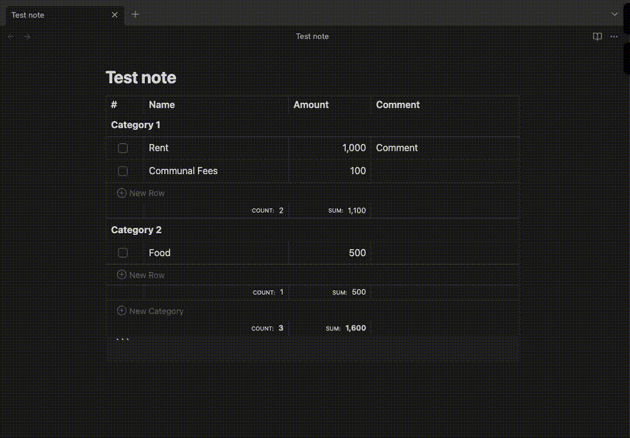

# ✨ Features

## Adding a new code block

Use the command palette (**Cmd+P** on macOS or **Ctrl+P** on Windows/Linux) and search for `Insert Budget Planner`.

## Adding a new row

## Adding a new category

## Sorting by column

